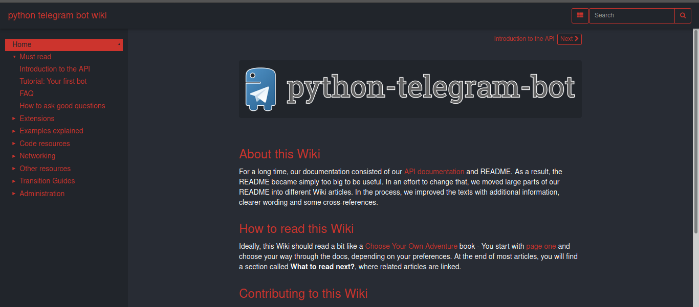
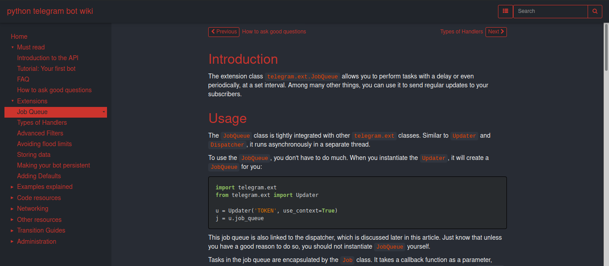

# python-telegram-bot-wiki-mkdocs
A [python-telegram-bot wiki](https://github.com/python-telegram-bot/python-telegram-bot/wiki) repository with mkdocs configuration to run locally.   

## Quick Start

### Requirments
* mkdocs==1.0.4
* mkdocs-windmill-dark==0.2.0

### Usage
- pip3 install -r requirments.txt
- run __mkdocs serve__

### Custumization
> If you want to use default mkdocs themes edit mkdocs.yml file and remove *theme: windmill-dark* or replace *windmill-dark* with *readthedocs* to use default readthedocs theme. [Read more about MkDocs](https://www.mkdocs.org)

### Screenshoot

